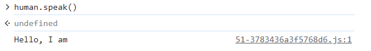
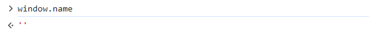

# 🌱 Implementing Debounce, Throttle and Curry in Javascript


---


In this blog post I will be implementing the three most important interview questions that are generally asked in frontend interviews - How to implement Debounce, Curry and Throttle utility functions in Javascript Before you embark on these implementations, you need to be comfortable with the following features of Javascript - 

- Closures
- `this` keyword
- `apply`, `call` and `bind`
- **Arity** of a function

## Debounce


### What is Debounce?


What is Debounce? Debounce is a technique using which you can substitute multiple functions calls with a single function call that happens after a threshold `wait` time. Every subsequent call to the function cancels the previous call and will execute the current call only if the function gets called after a threshold `wait` time.


### Implementation


Scheduling the function call to happen after a `wait` time reminds one of `setTimeout` which calls the function after a particular amount of minimum delay. You can also cancel the function call using the `clearTimeout` function.


```javascript
function debounce(func, wait=0) {
	let timerID = null;

	const debounceFunc = function(...args) {
		// Clear the previous timer
		clearTimeout(timerID);
		
		// Create a new timer
		timerID = setTimeout(function() {
			func(...args);
			timerID = null;
		}, wait);
	}
	return debounceFunc;
}
```


Here, we have leveraged the concept of **closures** to maintian access to the `timerID` inside the inner function and `setTimout`. This way we can cancel the call to `func` if it happens before the minimum `wait` time. 


Also notice, inside the `setTimeout` callback we are calling `func` directly with its arguments. We are however overlooking something here. We haven’t taken care of the context in which we are calling the original function. Since debounced function are supposed to behave the same way as the original function (execution wise), we would want to bound 


`this` to the context where it was invoked when calling `func(…args)`, but here `this` is bound to the `global` context.


To further check if this is how things are, we can try calling the debounced function over an `Object` to see if `this` is bound to its context.


```javascript
function sayHello() {
	console.log(`Hello, I am ${this.name}`);
}

const human = {
	name: "Divyanshu",
	speak: debounce(sayHello) // By default wait=0
}

// What do you think the output here will be?
human.speak();
```





See? `func(…args)` invocation is not bound to the `this` value of the `Object`, instead here `this` refers to the `global` context.





### Updated implementation


It’s simple to do it: We simply store the calling context of the debounced function in a `context` variable and pass it to `apply` while calling it on `func`. This way we successfully preserve the value of `this` when invoking `func`


```javascript
function debounce(func, wait=0) {
	let timerID = null;
	const debouncedFunc = function(...args) {
		const context = this;
		timerID = setTimeout(function() {
			func.apply(this, args);
			timerID = null;
		}, wait);
	}
	return debounceFunc;
}
```


Alternatively, instead of storing the value of `context` in a variable, you can use arrow function to define the `setTimout` callback. The value of `this` inside a arrow function is same as the context in which it has been created and is not bound to the environment in which the function is called.


```javascript
function debounce(func, wait=0) {
	let timerID = null;
	const debouncedFunc = function(...args) {
		timerID = setTimeout(() => {
			func.apply(this, args);
			timerID = null;
		}, wait);
	}
	return debounceFunc;
}
```


**Note:** However you need to be careful that `debouncedFunc` cannot be defined as an arrow function because in that case, `this` will be bound to the `global` context as `this` value in arrow functions is calculated at the time of creation and not during runtime from their environment in which they are being invoked.  


**References:** In case if you are a bit confused about the role of `this`, check out this awesome [article](https://medium.com/@griffinmichl/implementing-debounce-in-javascript-eab51a12311e).


## Throttle


Throttling is a technique using which you limit the invocation of a particular function to once every `n` seconds where `n` is the wait time. We will implement a function `throttle` that takes in a function and wait time as arguments and returns you a function that when executed can only be executed after the minimum specified wait time.


### Implementation


The above discussion should give you a hint that the function returned by throttling can only exist in two states:

- **Active**: When active, it can be invoked immediately following which it enters the inactive state.
- **Inactive:** When inactive, it cannot be executed and becomes active only after the minimum wait time.

Note that we need to switch back to **active** mode after the wait time. This should give you a hint that `setTimeout` would be needed as switching back to **active** state is time dependent. Also, since there are only two states, we can use a boolean to model it. 


Here’s how we will go about `throttle`'s implementation:

- Let’s assume that `throttle` takes in two arguments, `func` and `wait`. Where `func` is the function to be throttled and `wait` is the minimum wait time until the next invocation.
- We define a variable `flag` inside `throttle` and set it to `true`. This keeps track of the state of the function returned by it.
- Inside the returned function, we check if the `flag` is `true`.
	- If `true`
		- Allow the immediate invocation of `func`.
		- Set the flag to `false`
		- Start a timer to restore the flag back to `true` after `wait` time.
	- If `false`, do nothing.

Here’s the full implementation in code:


```javascript
function throttle(func, wait) {
  let flag = true;
  return function(...args) {
    if(flag) {
      func.apply(this, args);
      setTimeout(() => flag = true, wait);
      flag = false;
    }
  }
}
```


Note that since throttled functions are used just like the original function we should preserve the value of **`this`** when invoking the original callback functions. Therefore we cannot:

- Declare the inner returned function as an arrow function as it derives its `this` value from its lexical scope.
- Invoke the callback function as `func(...args)` because it will not forward the correct `this` context.

## Curry


Currying is a technique of converting a function which takes multiple arguments into a sequence of functions that each takes a single argument. Here we will be implementing a function called `curry` that creates a curried function for you. As an example, this is how a normal function differs from a curried function:


```javascript
const sum = function(a, b) {
	return a+b;
}

sum(2, 3); // Gives you 5

const curriedSum = curry(sum);
curriedSum(2)(3); // Gives you 5

const alreadyAddedThree = sum(3);
alreadyAddedThree(2) // Gives you 5
```


To better understand the implementation of a curry function that takes a generic function with ‘n’ arguments let’s try implementing a curried function for a function with 3 arguments first:


```javascript
const sumABC = function(a, b, c) {
	return a + b + c;
}

// Curried function
const curriedSumABC = function(a) {
	return function(b) {
		return function(c) {
			return a + b + c;
		}
	}
}
```


Here’s something you would notice from above - You keep returning a function until you run out of arguments, after which you return the calculated sum `a + b + c`. Also notice how we leverage **Closures** to access variables from the lexical scope for calculation inside the inner most function.


### Implementation


From the above discussion it is evident that we need to keep a record of the number of arguments that have been accepted so far in the sequential function calls. Moreover, the `curry` function needs to return a function that accepts a single argument which when invoked either computes the value of the callback or returns itself.


Here’s how we will go about its implementation:

- Keep an array `args` to keep track of all the arguments that have been passed.
- Return a named function `curried` which accepts a single argument `arg`, inside it:
	- Check if the `arg` passed to it is not `undefined`
		- If it’s not `undefined` push it to `args` array
	- Check if the `args` array has the same length as the **arity** of the callback function.
		- If it does, execute the callback and `return`
		- Else, the function should `return` itself

Here’s the full implementation in code:


```javascript
function curry(func) {
    const args = [];
    return function curried(arg) {
        if(arg !== undefined) args.push(arg);

        if(args.length >= func.length) {
            return func.apply(this, args);
        }

        return curried.bind(this);
    };
}
```


Note the use of `apply` and `bind` functions respectively to preserve the `this` context in which the first call to the curried function was made. Again, we didn’t define the inner function as an arrow function since arrow functions derive their `this` context from their lexical scope at the time of creation (which is `global` in this case) and not during runtime from their environment.


### Mistake


There’s one huge mistake in this implementation though. Can you spot it? You can only use the curried function once after which it becomes useless. Why? The issue is with shared `args` array in the lexical scope of the `curry` function. Once you've curried the function and provided enough arguments to invoke the original function (`func`), the `args` array retains those arguments. This means that any subsequent calls to the curried function will continue to use the same accumulated arguments, making the curried function effectively unusable after the first complete invocation.


### Updated implementation


In fact to fix this, we need to get rid of `args` variable from the lexical scope of inner `curried` function altogether. We make two changes respectively:

- We update the inner function `curried` to take a spread of arguments `...args`, and
- If the number of arguments is insufficient, the `curried` function is returned with its context bound to the current `this` and the accumulated arguments.

```javascript
function curry(func) {
    return function curried(...args) {
        if(args.length >= func.length) {
            return func.apply(this, args);
        }

        return curried.bind(this, ...args);
    };
}
```


So basically we fix this issue by not relying on a shared `args` array in the outer scope. Instead, it accumulates arguments using the rest parameter and binds them to the curried function using `bind`, ensuring that each curried function has its own set of arguments.

