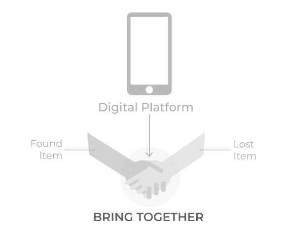
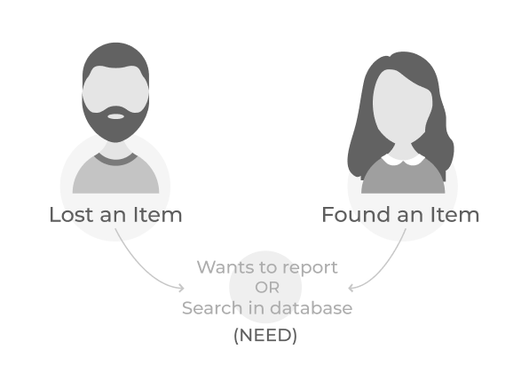
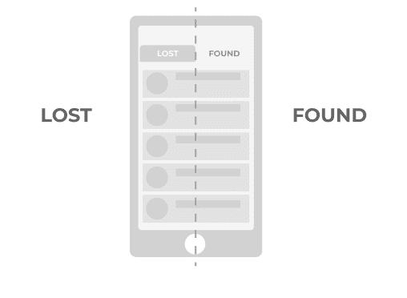
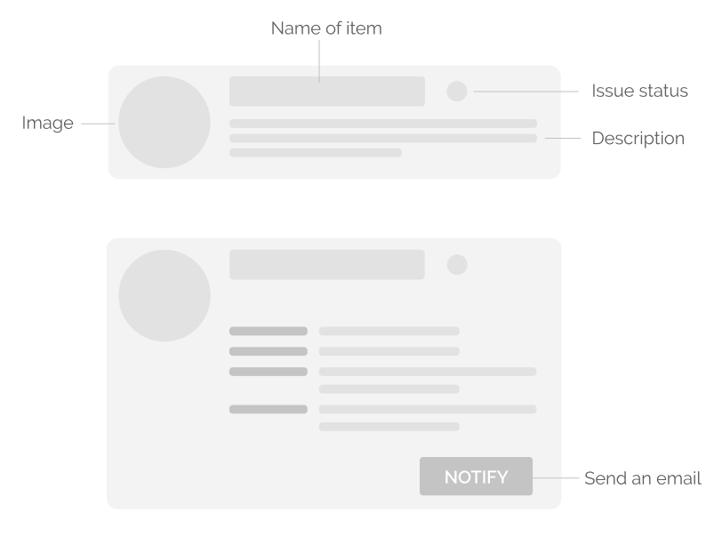
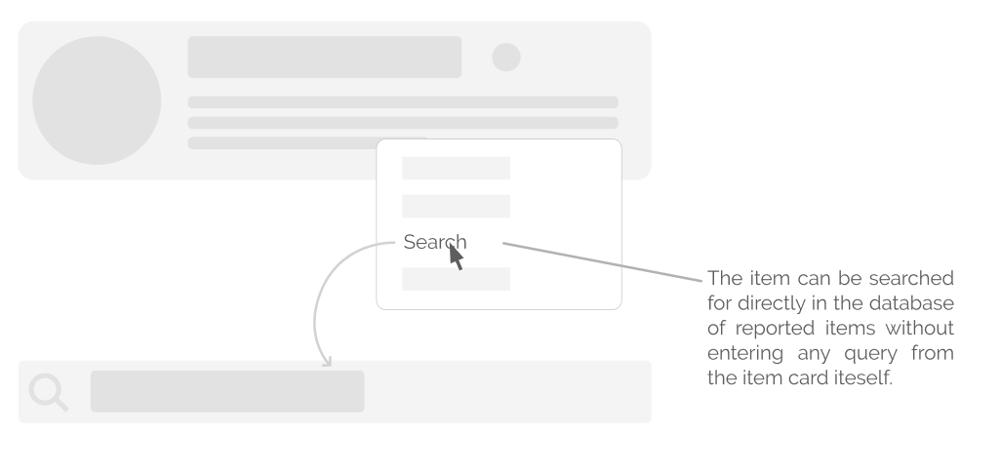
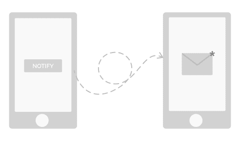
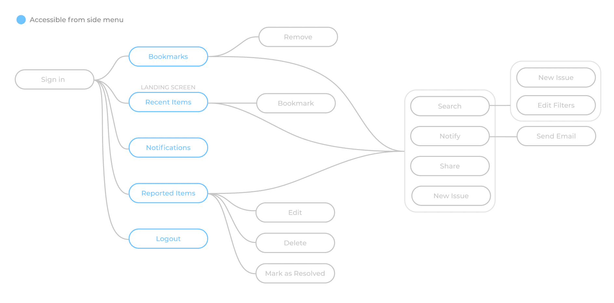
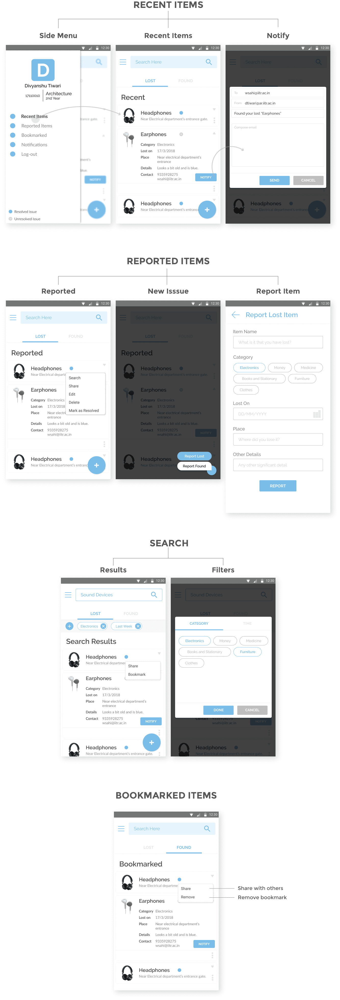

# 👻 Lost and Found

---

## Background

I was recruited at IMG as a designer last year. IMG is a group of around 40 tech enthusiasts that manage the central campus website and the intranet portal of Indian Institute of Technology, Roorkee.

All recruits go through a rigorous boot camp here, at IMG. In this, we are taught and given lectures about the new and existing technologies that are currently in use in our products. Assignments are given to us to complement and strengthen our learning.

During the **summer break** of my 1st year, we were asked to design an **android** mobile app for the **“Lost and Found”** web app that was then currently in use by the campus **junta**.

## Design Process

### Problem Statement

You have something at one moment and another, you end up losing it. You don’t know where it went so your first instinct is to search the last place you remember yourself with that object. Or, maybe you are going somewhere, and you accidentally stumble upon someone else’s stuff. Your first instinct, in this case, is to search for possible clues that can help in identifying the person to whom the object belongs.

Our goal, in this case, is to design a platform that brings the following two kinds of people together

- People who have found an item, and
- People who have lost an item,

so that they can mutually help each other out. The platform is specifically going to be tailored for the IIT Roorkee campus junta.

### Understanding User

As stated in the problem statement itself, there are going to be two kinds of people that will use this platform:

- People who have **lost** an item. They can be helped by letting them know that someone else has already found it or else let them report it so that in the case when someone finds it, he/she can report it back to them.
- People who have **found** an item. They can be helped by letting them know that there’s someone who has lost an object with a matching description or else let them report it on the platform so that the owner can find it.

### Design Concept

The entire application is divided into two parts: a list of lost items and a list of found items.

### Features

- **Sign in:** Each student has an institute id using which he/she would sign-in into the platform.
- **Item Card:** Each reported item is displayed as an expandable card on the screen. The card contains related information about the item such as its photo, name, category, date, place, contact and other details. Each card also has a visual indicator that indicates the status of the issue, i.e. whether it has been resolved or not.
  
- **Recent Items:** Displays a list of all the items that have been recently reported by the community.
- **Reported Items:** Displays a list of all the items that have been reported by the user. The user can directly search for his reported items from here without having to retype in the search bar.
  
- **Notification:** Contains notifications related to the items that have been reported by the user to help him keep track of all the concerned information. For example, the user will be notified in case someone claims an item reported by him.
- **Bookmark:** Contains a list of all items that have been bookmarked by the user for future reference.
- **Report:** Contains a list of all items that have been bookmarked by the user for future reference.
- **Notify:** To send an email (custom or automated) to the user who reported that item. Parallelly, a notification will also be sent to the user.
  
- **Search bar:** To search for items that have reported as either lost or found. Filters can be used to get more accurate search results.
- **Edit:** To search for items that have reported as either lost or found. Filters can be used to get more accurate search results.
- **Share:** To share an item with someone else. That user will get a notification about the same.
- **Delete:** Deletes the item that user reported as either lost or found.
- **Mark as Resolved:** Marks the issue as resolved for the reference of other people. Option available only for items reported by the user itself.
  

### Flow

### Deliverables

## Conclusion

It was my first time to do this whole thing on my own, and it took me about a month to design this app, starting from initial ideation to final screens. Creating this app was really fun, and it helped me in improving my UX flow, UI and interaction design skills in general.
