👕 T-Shirts and Data Viz
========================

* * *

Back Story
----------

For this year's IMG T-shirts, I wanted to implement a unique design, something that's out of the ordinary. When I went for my internship in Bangalore, I attended a workshop on Data Visualization. Our instructor, [Rasagy Sharma](https://twitter.com/rasagy) introduced us to data visualisation and how it can be used to make sense out of chaos.

One of the projects that he showed us was [Viznam](https://github.com/rasagy/viznam). In this project, he experimented with names. For each name, he used an algorithm to map it out visually. Each name that was visualised looked similar since they originated from the same algorithm, but their exact geometry differed.

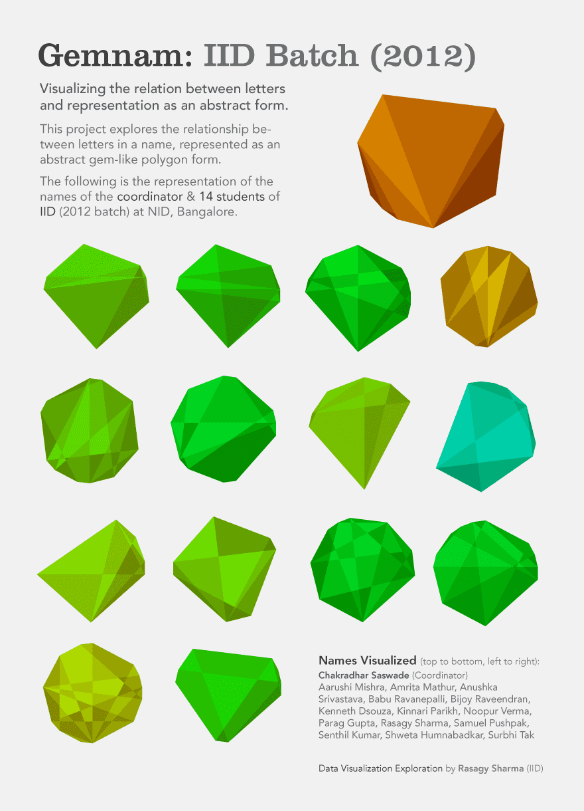

I decided to work upon something similar. Hence for our T-Shirt design, I decided to visualise the names of each of our team members on it. In this article, I'll be sharing the experiments that I did in the process.

Who are we
----------

IMG is a group of around 40 tech enthusiasts that manage and maintain the central campus website and the intranet portal of Indian Institute of Technology, Roorkee. We represent the technology front of the campus. We are a bunch of people filled with curiosity and an enthusiasm for building things with technology.

I wanted the result to reflect something similar. Hence, initially, I began my experimentation with diagrams that looked like a network of wires. The following section will walk you through my ideas and iterations.

Experimenting
-------------

### Circular network diagrams

Initially, I experimented with circular network diagrams and bezier curves. I wanted to use a circular network as a visual representation of a network of wires.

#### Visual 1

Here, the name has been represented as a network of connected points on the circle. 26 points have been placed uniformly on the circumference of the circle, with each point corresponding to an alphabet. Starting with 'a' at the top, followed by the rest in a clockwise fashion. Here are some of the examples below: [Source](https://editor.p5js.org/clinckzone/sketches/0sE62bbq1)

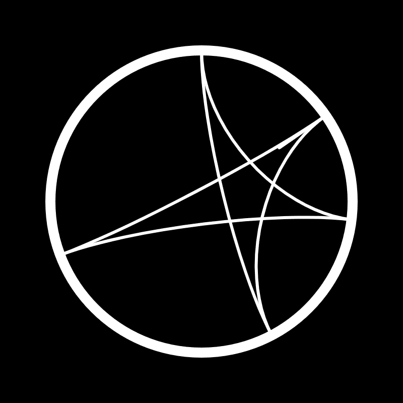
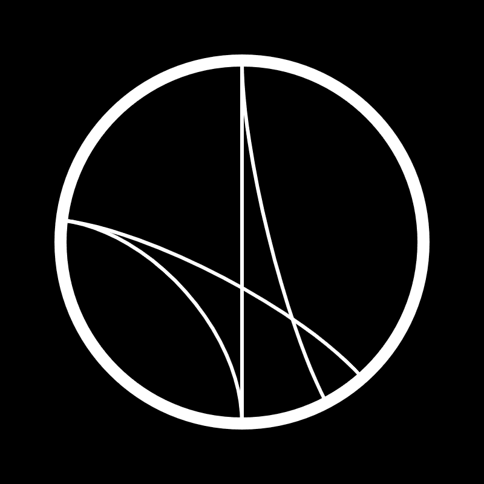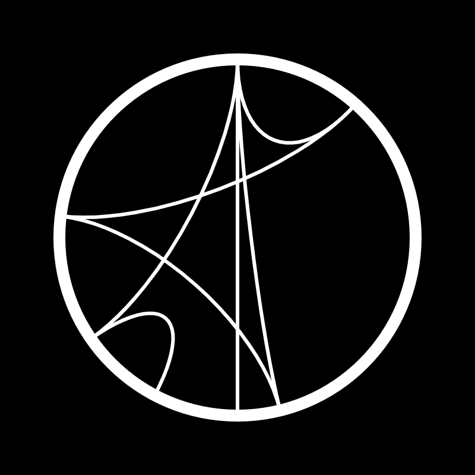
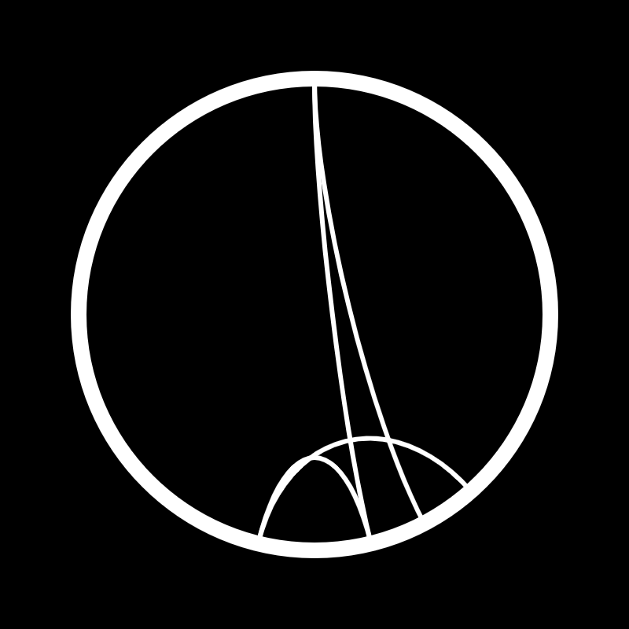

#### Visual 2

Here, all the letters of the name are connected to the first letter of the name. One drawback in such an arrangement is that you cannot figure out someone's name from the visualisation. Here are some of the examples below: [Source](https://editor.p5js.org/clinckzone/sketches/hYMnoliOm)

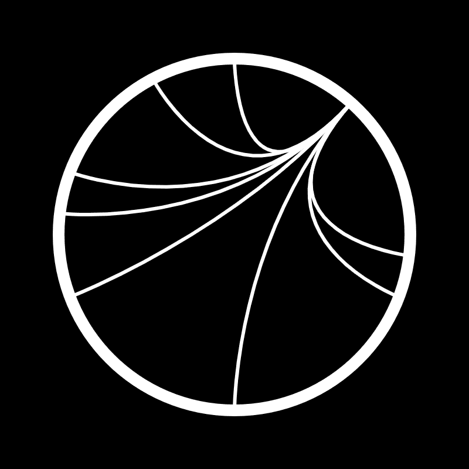
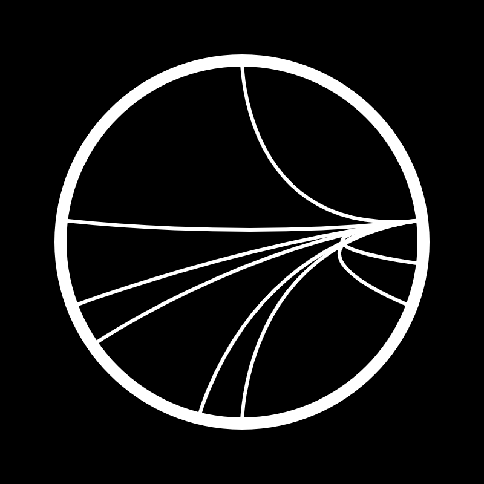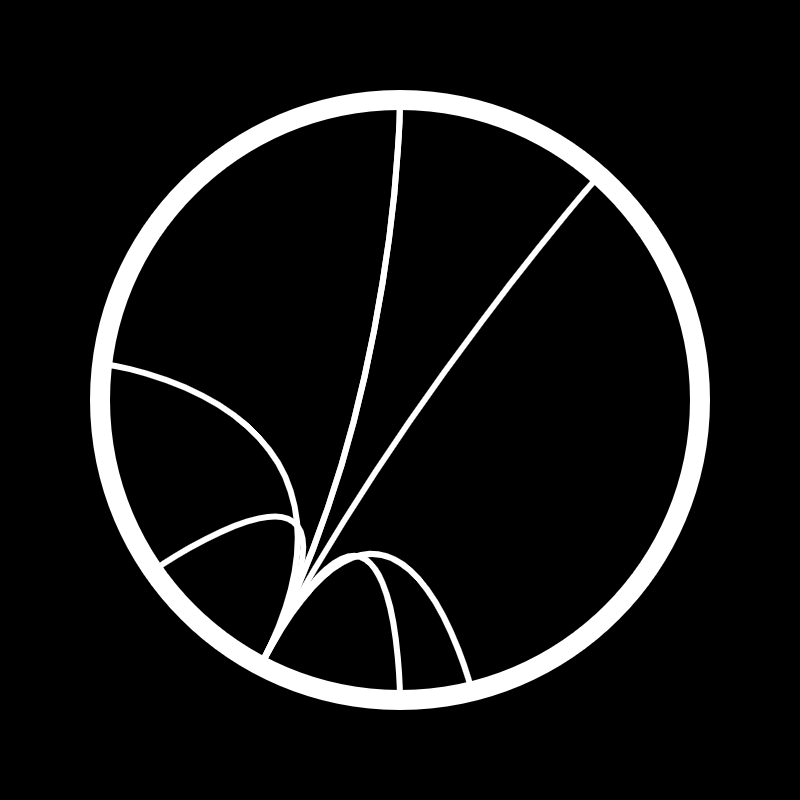
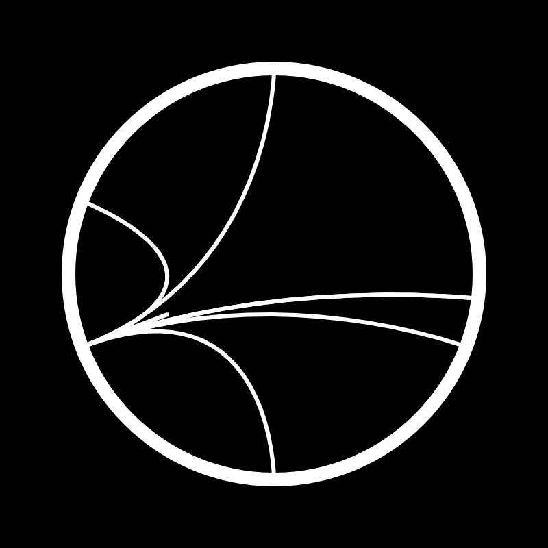

### Radar Diagrams

#### Visual 1

This visualization contains as many equiangular lines as the number of letters in the name. Length of each line is proportional to its distance from the alphabet "a". Joining all the endpoints of these lines gives you a polygon. Here are some examples below: [Source](https://editor.p5js.org/clinckzone/sketches/ZZ6PCz2P5)

#### Visual 2

Same as before, but with a flat appearance, since it wasn't possible to print patterns that had a gradual gradation in their saturation. The black stoke represents the outer boundary of the IITR campus. Seems a childish idea to me. Here are some examples below: [Source](https://editor.p5js.org/clinckzone/sketches/yOOoNas2_)

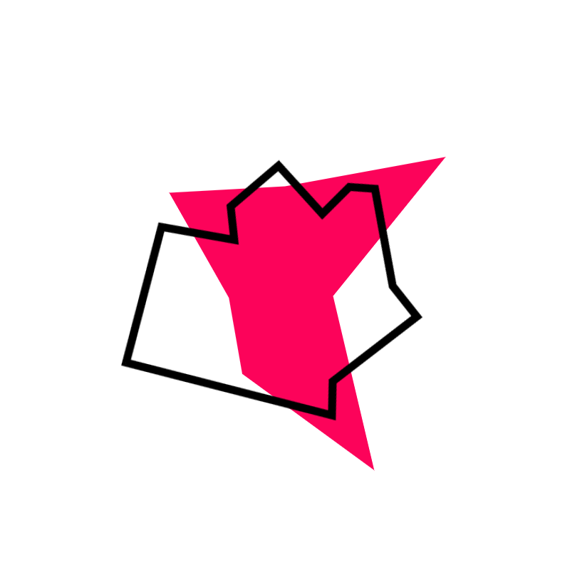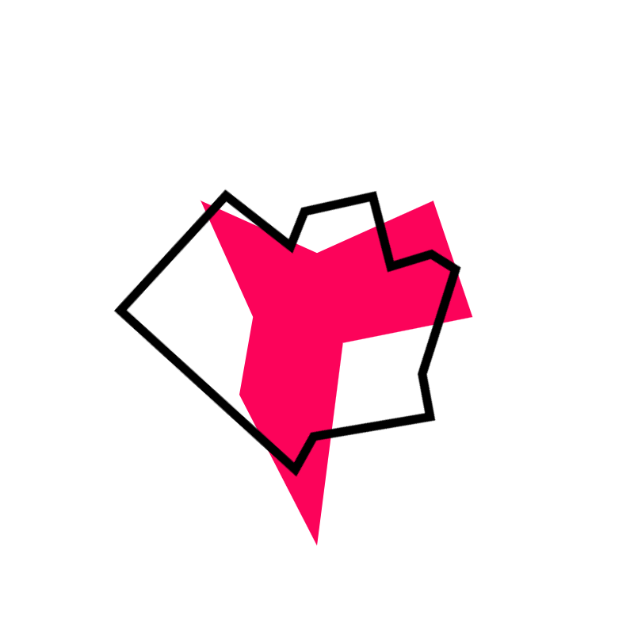

#### Visual 3

Instead of joining the endpoints of the line with straight lines, a single curved line has been used. Here are some of the examples below: [Source](https://editor.p5js.org/clinckzone/sketches/msPQz86H)

#### Visual 4

Same as before just added some lines to the visual. I find that these lines give it a more professional look. Here are some examples below: [Source](https://editor.p5js.org/clinckzone/sketches/zoiJQFcN)

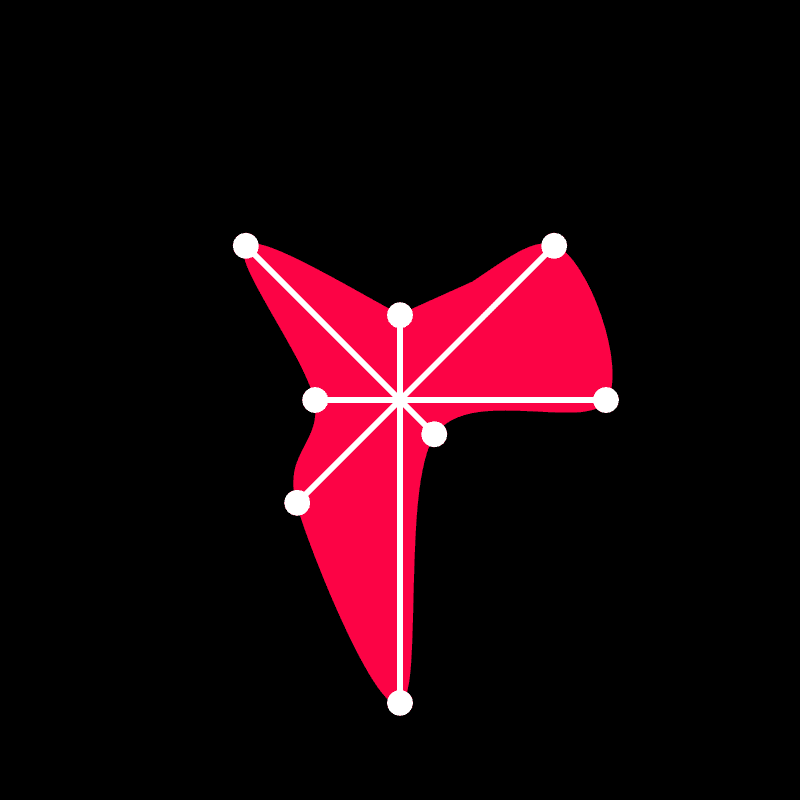

Result
------

I posted these visualisations on our group's slack workspace and asked everyone to vote for the one that they liked the most. To my surprise, almost everyone gave a thumbs-up on my first iteration. Since in it, it was possible to create complex visualisations that nearly every time looked beautiful. Plus, it was also easier to understand its relation with your name. In practice, it isn't all about what your visualisation is expressing; a lot of it also depends on factors that aren't related to aesthetics such as scalability and inclusivity in this case.

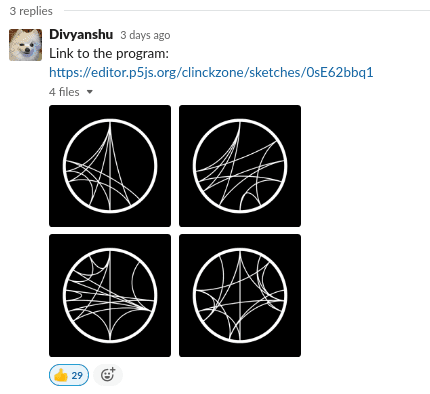

### Mock-ups

