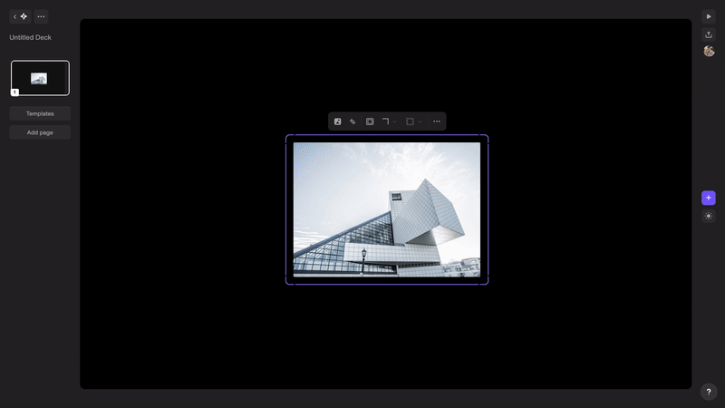
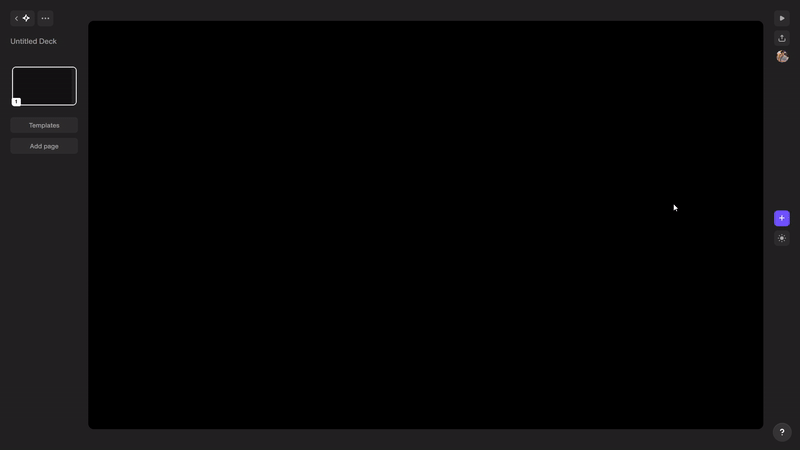
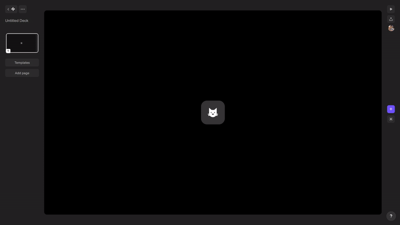
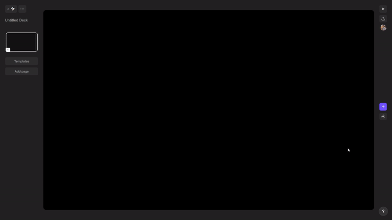
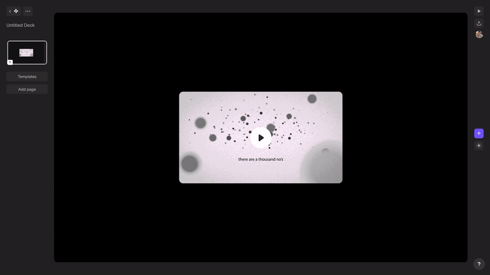

# ⭐ Chronicle Endeavors

---

[Chronicle](https://chroniclehq.com/) is a startup dedicated to redefining the creation and delivery of engaging presentation experiences. I began my journey here first as an intern before transitioning to a full-time software engineer role. Apart from helping out the senior team members in addressing and rectifying critical product bugs, I contributed to several facets of the software which I have **chronicled** below.

Chronicle follows a **block** based approach for creating slides in your a presentation. There are a variety of pre-made beautiful blocks available for you to help you out. Before we go ahead and try delving deeper into the work described above, here are a few terms that would aid in understanding:

- **Forward slash menu:** The way you add blocks into your slides is by either pressing the **forward slash** button or clicking on the **'plus'** button on the right hand side. This opens up a side-drawer from where you can search and select the desired block. This menu is completely navigable through keyboard too.
- **Block toolbar:** Once the block is added to your slide, you can edit the properties of the block by selecting it. A toolbar pops up above the block once it is selected, and from there you can edit its properties.
- **Contextual menu:** Inside this block toolbar, you would find a three dot icon which you can click. This opens up a menu that holds the same block edit commands as in the toolbar. This menu can also be opened using **'Cmd + /'**shortcut. You can search and select the properties you want to edit. The menu is completely navigable through the keyboard too.

### Image Picker

When you go ahead to add an **Image block** into your presentation, the first thing that opens up is the **Image Picker**. It lets you choose from stock images fetched from [Unsplash](https://unsplash.com/images) and [Giphy](https://unsplash.com/images). A set of 30 images are loaded in the first fetch and more are fetched as you scroll down. You also have a **search bar** to let you search for the kind of images you are looking for. There's also an **upload button** to let you upload an image from your desktop if you want.

Once you have an Image block in place, you can go ahead and change it's properties from the **Contextual menu**. From there you can choose to **Replace**, **Crop**, or edit the **Shape** of the image. In there, you also have block actions common to all blocks like - **Bring to Front**, **Bring to Back**, **Duplicate**, and **Delete**

### Icon block

You add the **Icon block** from the forward slash menu.

Using either the **Contextual menu** or **Block toolbar**, you can choose to **Replace**, or edit the **Shape**, and **Size (S/M/L)** of the icon.

### Video block

You add the block from the **Forward slash menu**, and using the **Block toolbar**, you can choose to edit **URL**, **Start time**, or **Navigate** back to the original video. The **Contextual menu** for this block only contains common block actions and no block specific actions.

