🥇 Urban Trails
===============

* * *

Overview
--------

Myself along with two of my batchmates were announced as the national winners of the DesTech Challenge ‘18 organised by NASA India for our project **Urban Trails**. This article aims to explain the submission that we gave in as our entry for this challenge. For this challenge, We were required to design a digital platform to capture local urban trails through smartphones to let creatives capture, encapsulate and share their journey in a meaningful way.

About
-----

DesTech Challenge is a unique national design competition in the sense that it aims to bring creative thinking and digital advancements in the built environment sector together. It challenges creative thinkers to explore opportunities within ‘Smart City’ systems, processes and engagement strategies.

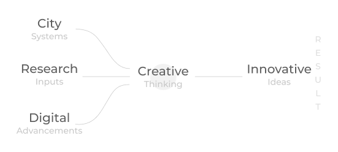

It sets itself apart from conventional design competitions by providing mentoring and research inputs from international experts to bring the best out of the participants. The challenge encourages participants to collaborate with fast-emerging digital sectors as well as local citizens to bring forward innovative ideas.

Challenge
---------

Architects see the world with a creative lens. They capture their experiences through a range of mediums and build their ideas through inspirations that they come across in their environment.

What if they can encapsulate their experiences in a meaningful way and share it through the medium of a common platform? Imagine the possibilities generated with this exchange of thoughts to create new and innovative ideas!

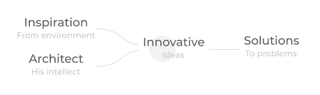

What if they can encapsulate their experiences in a meaningful way and share it through the medium of a common platform? Imagine the possibilities generated with this exchange of thoughts to create new and innovative ideas!

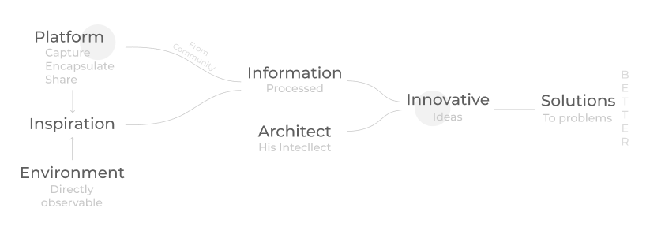

### Problem Statement

Create a conceptual design of a digital app to capture local urban trails through smartphones that would allow one to capture, encapsulate and share his journey in a meaningful way via a digital platform.

The app should give architects and students the ability to:

*   Dynamically capture a short journey of theirs on a map through geospatial technologies via smartphones.
*   Capture stories and input factual information about a place or a building.
*   Tag, classify and record onsite, specifics about the type of architecture, details and building elements.

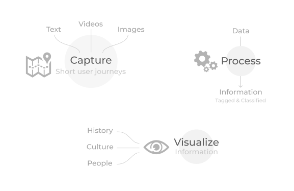

*   Provide broad themes of elements that the app could capture and organise.
*   Suggest how the use of multimedia such as photos, videos etc. could be organised and analysed to provide meaningful insight into the built environment.
*   Suggest visualisations to capture and represent the culture, people, and essence of a place through the app.
*   The ability for users to download and refine content through a smartphone onto a web interface.

### Submission Requirement

Compile the various features of the app and visually explain their implementation via wire-frames.

Design Process
--------------

Before we started with anything else, we had to understand that for whom are we designing our app. Answering this fundamental question gives off a way to understanding their needs and problems leading to features that we would like to have in our application.

### Understanding User

As per the brief, architects and students are our target audience for this application. A large part of their work and lifestyle revolves around travelling and visiting new or the same old places. With travel, we not only refer to travelling to far off sites but also to the ones that are local to them. For each such visit, the reason might be different:

*   A lot of times, architects are required to go for **site visits** at various stages of their ongoing projects. These visits are essential for several reasons: Firstly, they help the architect to become familiar with the site. Secondly, a lot of ideas and creativity pops up onsite. Thirdly, an architect is not only responsible for his design but its proper implementation and management also. Hence these site visits allow him to observe a project’s progress carefully.
*   Students also go for **site visits** for similar reasons. They don’t do it for management purposes though since their projects are generally for their design studios and hence aren’t implemented in real life.
*   One may also travel for **documentation** purposes. Architectural documentation aims to understand the logical reasons behind the implementation of various visual and non-visual elements in the design to complement its functionality.
*   Search for **inspiration** may also drive such pursuits.
*   It may also be a **casual exploration** of a new built environment to learn about and experience new cultures, people, architectural styles, etc.

### Needs and Problems

To better empathise with our users, we started off by imagining ourselves on a similar journey. Through this exercise, we looked for their needs and potential problems that may be solved using technology:

*   What are the places he/she has explored, and what yet remains to explore?
*   How should one go about finding new places and built forms to visit as per their interests?
*   What is the accessibility of a location from one’s desired place of interest?
*   What are the local means of transportation available to one?
*   What are some intermediate attractions that he/she might be interested in checking out?
*   What are the different kinds of architectural elements present in a building?
*   What is the architectural style of a built form?
*   How vital a built-form is from an architectural point of view?
*   What are the ways in which one can share his ideas, opinions, knowledge, insights about a particular topic/experience?
*   How can one know about the ideas, experiences, opinions, insights of others?

### Design Concept

Day to day activities involves the creation of data in huge bulks which in turn brings out the need to store, retrieve, edit, organise, share and extract useful information out of it. To deliver an exceptional experience, we aim to use data capturing and processing techniques to produce upon the following:

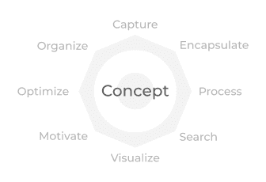

1.  **Capture** videos, photos, and text in the form of posts and articles.
2.  **Encapsulate** and **organise** the same to provide meaningful insights about a place or built form along with receiving ideas on it from others.
3.  **Automated processing** of this data to automatically tag and classify user-generated content.
4.  **Search** for information that has been shared by other users under various categories.
5.  **Visualisations** to provide insights into the popularity, history, density, walkability, accessibility, mobility and weather of a place or a building.
6.  **Motivating** users to explore beyond what they have already seen and experienced.
7.  Finding and planning **optimised** routes by one’s interest and previous interaction with the application.

### Features

**Capture:** Capture data about the site or place in the form of photos, videos, and text and then post it as a new **tile** to share it with the rest of the world.

**Feed:** Captured data is first organised and then displayed in the form of a post consisting of pictures, videos, and text. Posts are shown in the feed, following one’s interest and people whom he/she follows in the community. Here we have termed a **“Post”** as **“Tile”** since we are designing in the context of architecture specifically.

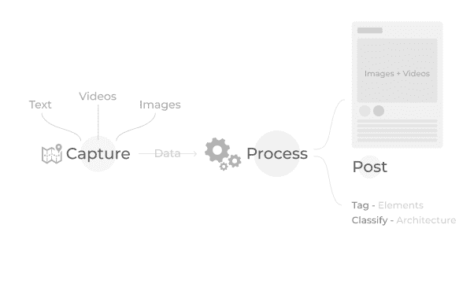

*   A tile can be shared or given stars by users in case they find it useful. This way, the post gains popularity gets spread to other users of the community.
*   The visual content of a tile(pictures and videos) is uploaded on a cloud server which then analyses it for architectural elements present in it using Machine Learning algorithms. Detected parts are then processed together to classify the type of architecture it belongs to.
*   Each tile has a comment section to promote discussion within the community.

**Search:** A user can search for information under various categories using this feature. The result of a query depends on the category a user wants to search in and the keyword that he/she has entered. The different categories include-Trending, Latest, People, Places, Elements, Hashtags.

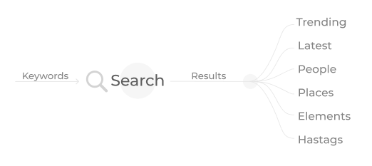

**Map:** Contains a search feature to let you search for different places on the map and a suggestion area to suggest new locations for exploration. Once the user selects his place of interest, he can:

*   Start a journey to the chosen site. The app then advises the user several optimised routes to reach his destination following his preferred mode of transportation and intermediate areas of interest.
*   Find out more interesting insights about the place in a visual manner through the aid of maps. These maps have useful data already mapped on them.

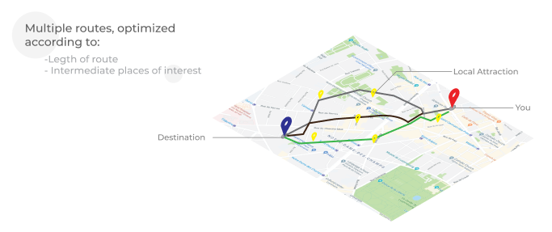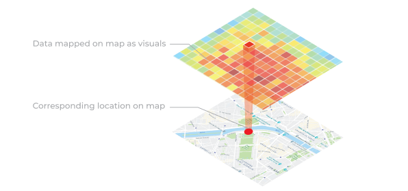

**Explorer Mode:**Activating explorer mode darkens all the areas on the map that currently remain unexplored by the user, showing him only those that have been explored by him.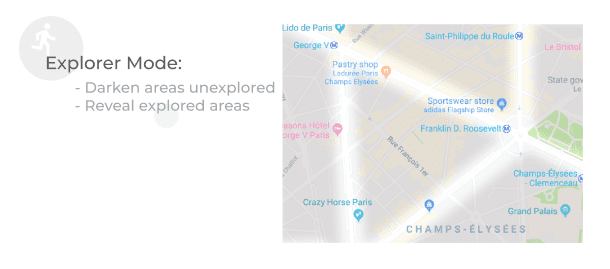

**Profile Screen:** Profile screen is made up of three sections, namely- facade, notification, and messages. Facade sections consist of tiles that have been posted by the user in reverse chronological order. Travellers can personally connect on chat with other users present on the platform using the messaging section. Users are regularly notified about the new happenings around them to which they have subscribed via the notification section.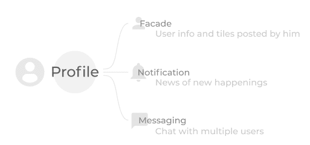

### Flow

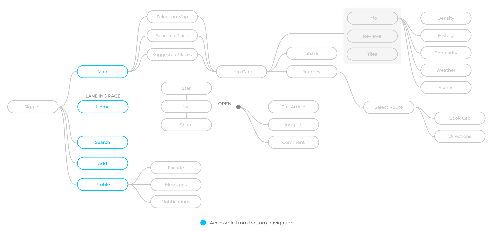

### Screens

Conclusion
----------

This was the first time that I participated in NASA. Since I had prior experience of designing for the digital media, my team had an upper hand in the competition and our major challenge was to come up with features that are unique and feasible at the same time. Participating in this competition not only improved my product design skills in general but also made me more knowledgable in the domain of architecture itself.