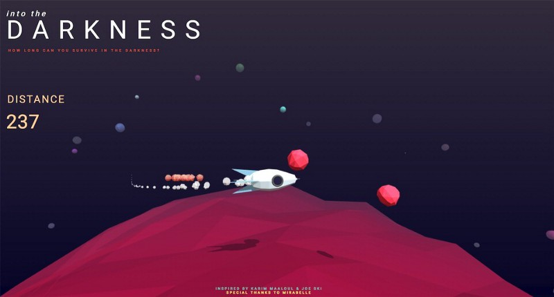
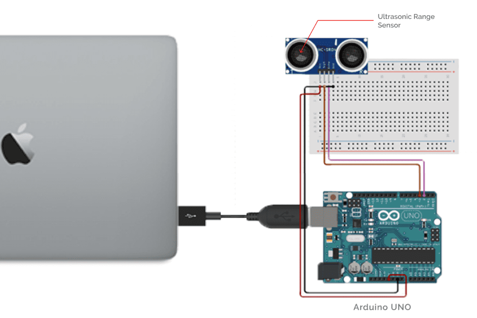

🚀 Flappy Rockets
=================

* * *

Motivation
----------

During my first-year summer vacations, I was once watching ITP winter show 2017 on youtube. ITP holds its winter and summer shows at the end of each semester where its students exhibit their semester-long projects to the public. One of the projects that I found very interesting was called [Into Darkness](https://itp.nyu.edu/shows/winter2017/into-the-darkness) by Heng Tang.

It's a game full of space elements and physical interactions. The best part of the game is that the player controls the onscreen spaceship with a miniature physical spacecraft. Behaviours exhibited in the game's virtual world accurately imitated the player's actions in the real world. Such an interface where the user interacts with the digital information through a physical environment is called a Tangible User Interface.

The seamless connection between the real and the virtual world is what makes interacting with the game so intuitive. In my utter fascination with this intuitiveness, I decided to develop my own version of this game.

The Game
--------

### Concept

Flappy Rockets is a single-player game developed on [Processing 3](https://processing.org/). To gain points, you are required to dodge incoming asteroids and protect your spaceship from getting damaged. The user interaction involves the use of a miniature physical spacecraft to be used as a controller.

### Implementation

The game has been built using Processing 3. Further, I have used [Box2D](https://box2d.org/) as the game's physics engine which is mainly responsible for handling all the collision-related tasks. In case you are interested in knowing more about the inner implementation of the game, you can have a look at its source code hosted on [Github](https://github.com/clinckzone/flappy-rockets). Following is the circuit implementation for the hardware used in the game:

### Demo

[Interaction Demo](https://www.youtube.com/embed/7ZwPCXcItlo)[Gameplay Demo](https://www.youtube.com/embed/H9chWg-RbNc)