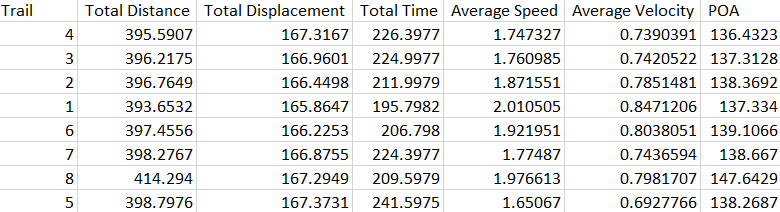
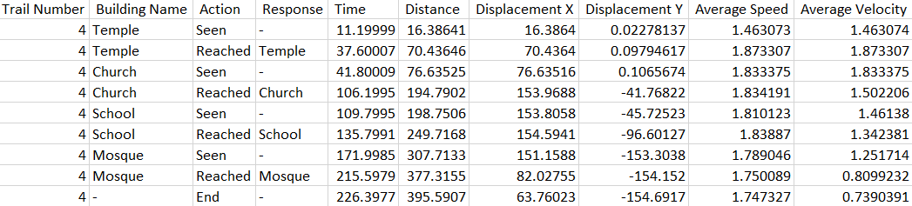
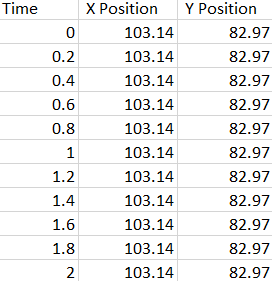
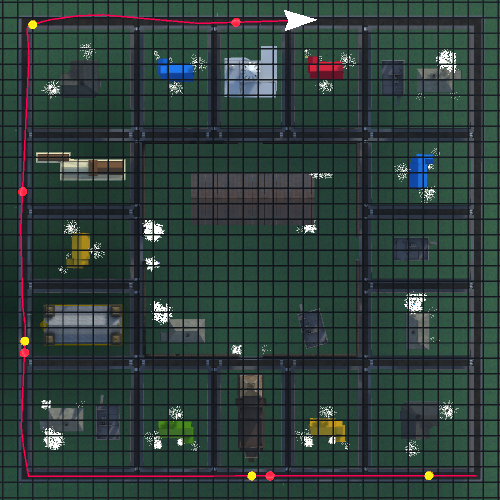
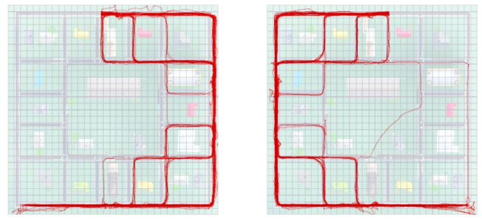

⛔ Navigation in VE
==================

* * *

Overview
--------

This study aims to see if a live updated bird's eye view or a written description of the same would aid navigation utilising spatial landmarks in a coloured or black/white environment.

The virtual environment (VE) software was used to set up the experiment. Sixty-nine people between the ages of 18 and 35 volunteered for the study (49 men and 20 women). Instruction with Bird's eye view, Instruction without Bird's eye view, No Instruction with Bird's eye view, and No Instruction without Bird's eye view were the four experimental conditions in the study. After an initial tour of the virtual area, participants were given a test, separated into two halves, with a 5-minute pause to decrease the learning effects of the trail. Individuals were randomly assigned to four different coloured and black-and-white (B/W) trails. After an activity break, the participants completed the second portion of the experiment.

The impact of route instructions on landmark identification was proven in both colour and black-and-white environments in the study. The findings also show that a visually depicted route instruction, which is generally independent of context, can be used to reduce wayfinding.

My Role
-------

In this project, I was primarily responsible for developing the virtual environment on Unity. This was used to collect behavioural data of users by testing their performance on particular tasks. Below is a demonstration video of the software that was finally used in the experiment.

[Demonstration video](https://www.youtube.com/embed/NfiAWlUCf5o)

The software collected various kinds of behavioural data of the participant for each completed trail in an excel sheet.

I also developed visualizations for participant’s behavioural data thus collected to help my supervisor gain insights into their behaviour. These visualizations were created programmatically using Processing 3.

