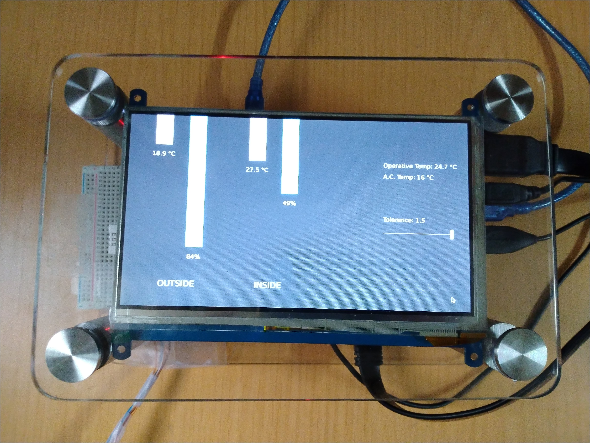
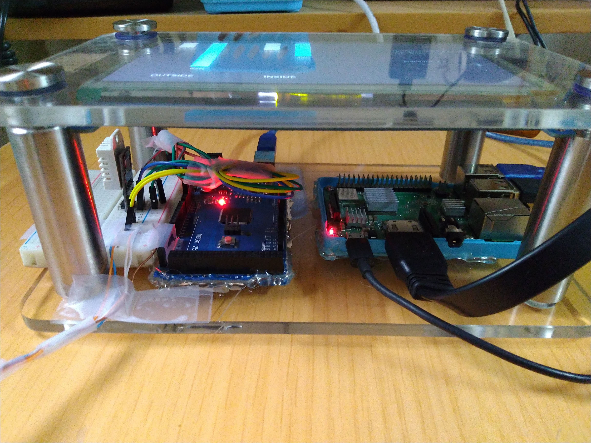
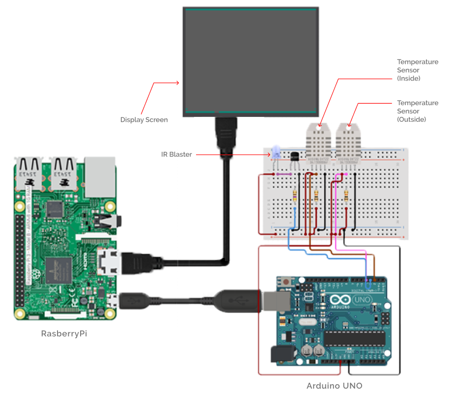

# 🎛️ Smart AC Controller

---

## Overview

During my 2nd-year winter vacations, I worked as a student assistant to Prof. E Rajasekar at NetZed Lab. It is a Net-zero energy design lab in the Department of Architecture and Planning at IIT Roorkee.

Here, I was given the task of developing a prototype of an automated AC controller that would maintain the AC at a temperature optimised for human comfort and energy efficiency.

## How Does it Work?

### The Algorithm

The device first calculates the operative temperature for the AC. It does this by analysing the interior and exterior temperature of the room every minute as per the following equation:

\\[T\_{opt} = 0.78\*T\_{out} + 23.25°C\\]

This temperature is then optimised either for human comfort or for energy efficiency. We call this temperature as the control temperature. This temperature data is then sent to the AC as an IR signal.

### Project Setup

- RasberryPi receives indoor and outdoor temperature + humidity information from Arduino, using the DHT sensors that are directly connected to it.
- It then calculates the Control temperature every minute sends it back to Arduino, which manipulates the AC temperature using an IR blaster directly connected to it.
- Simultaneously, a multi-touch screen displays all the related information about the current state of the AC and the environment it is in.

