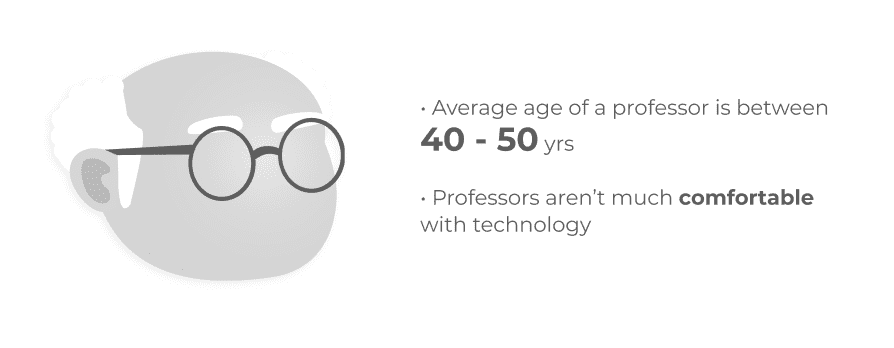
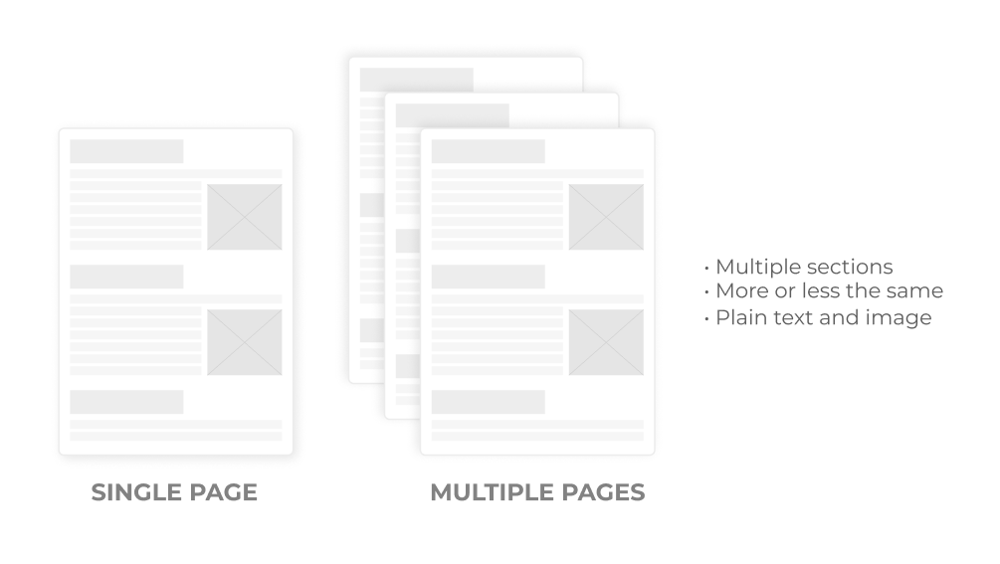
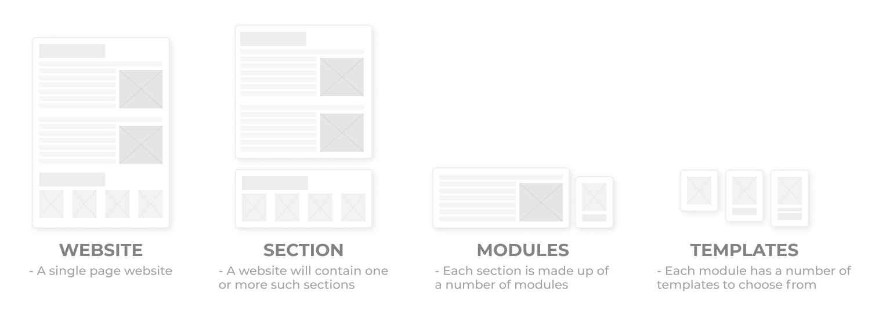
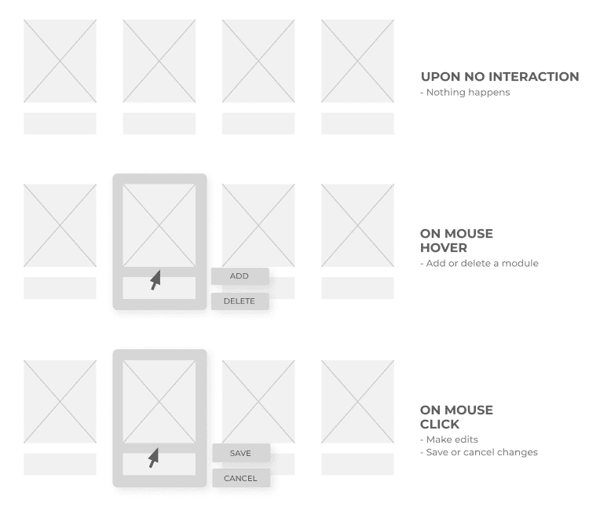
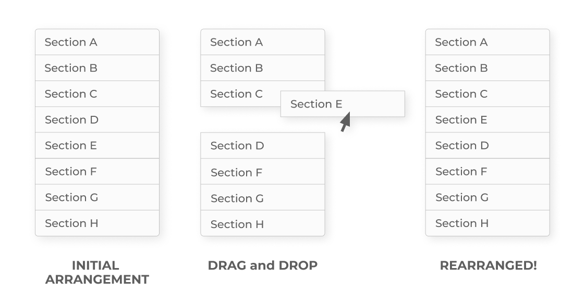
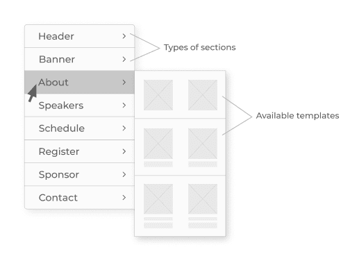
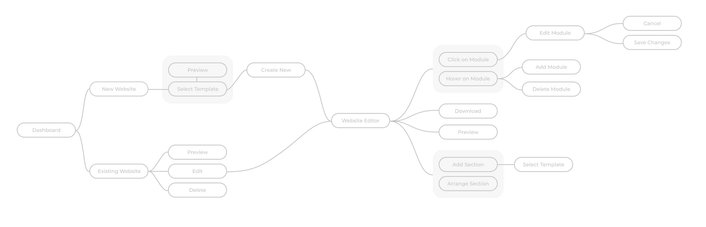
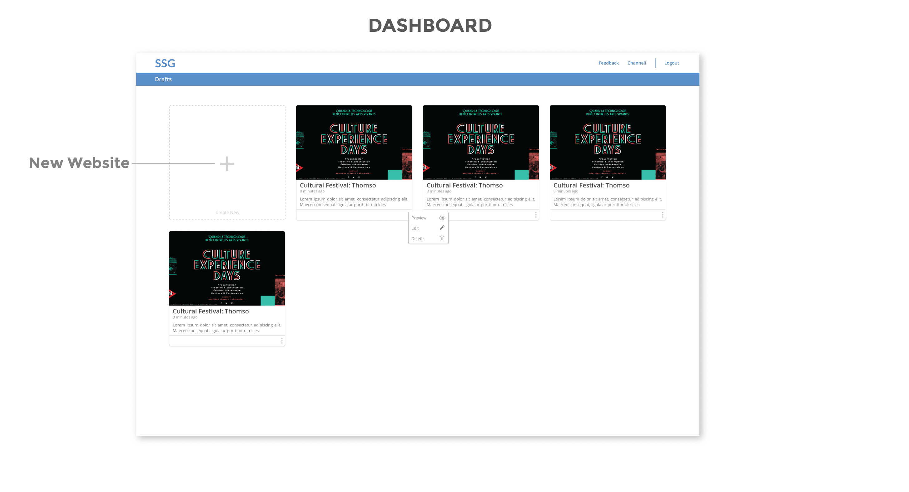
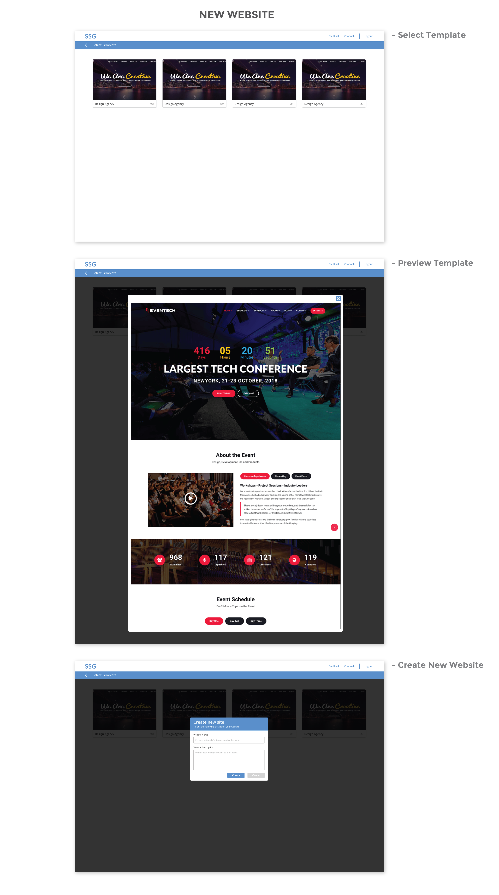
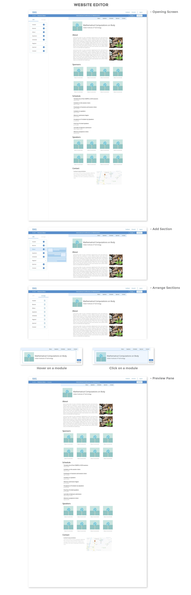

💻 Static Site Generator
========================

* * *

Why we built SSG?
-----------------

IMG is a group of 40 tech enthusiasts that manage and maintain the central campus website and the intranet portal of Indian Institute of Technology, Roorkee.

The group used to receive a lot of requests from **professors** of different departments to code **conference websites** for them. Such tasks are quite repetitive and laborious; therefore, we decided to build a web app to automate this process. Using this, they’ll be able to make simple websites on their own without having to code.

I was solely responsible for handling the **design** of this application.

Design Process
--------------

### Understanding the user

Since I’m a college student, I get to interact with professors daily, hence I had an idea of their general psychology and how comfortable they are in using technology.

The average age of a professor is between 40–50. They aren’t as comfortable with technology as their students, nor do they have a good design sense when it comes to designing websites. Hence, they may not be used to the new ways of interacting with technology and might require design assistance frequently. This was kept in mind while designing interfaces and interactions for the app.

### Deciding Use-Cases

Majority of requests that we received from professors were for developing conference websites. Hence we decided to specifically tailor our application for **conference websites**.

However, the application is flexible enough so that one can make simple text and image-based websites for different use cases such as:

*   Personal Website
*   Portfolio
*   Blog, etc.

### Structure of Conference Website

I took reference of different conference websites from various IITs to understand how a typical conference website is structured.

Here are some pointers that I gained:

*   A conference website can be of a single page or span across multiple pages depending upon how big the conference is.
*   Each website is made up of multiple sections which are either spread across different pages or are present on the same page.
*   For most of them, the sections were more or less the same.
*   Each section consisted of nothing more than but plain text and a few images.

### Design Concept

A website created using SSG will be a single page website consisting of multiple sections. Users will have the freedom to add, delete or (re)position a section as per their choice. Each of which will be made up of several repeating modular units. The user will have the freedom to choose from multiple templates for these sections.

### Features

*   **Drafts:** Landing screen of the app which contains a list of all the previously created websites that are either complete or incomplete in reverse chronological order. From here, one can directly **preview**, **edit** or **delete** a site.
*   **Create:** Creates a new blank website. To create a new website, you are first required to choose an appropriate design template for the site. You then proceed to fill in the details about the website like its name and a short description about it.
*   **Edit:** Edit an existing website. This opens up the website editor where you can make changes.
*   **Website Editor:** Place where you actually create/edit your new/existing website. Here, you can **add**, **delete**, **edit** or **arrange** different sections of the website. In each section also, you can **add**, **edit** or **delete** individual modules. While adding a new section to the site, you have the **freedom** to select from several templates having different modules.
*   **Preview:** Gives you a preview of the way the website will look like once published to the web.
*   **Download:** Lets you download the website as an HTML+CSS package.

### Interactions

**Interaction with a module:** Hovering above the module of a section one can either add a new module to the right of it or delete it. Clicking on a module allows you to edit its contents and then either save or cancel the changes so made.

**Arranging Sections:** Arrange tab present on the left side of the website editor is meant for rearranging the order of different sections of the website being constructed.

**Adding a Section:** Add tab present on the left side of the website editor is meant for adding new sections to the website being constructed.

### Flow

### Deliverables

